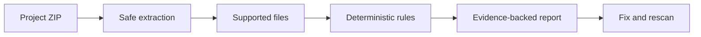

<div align="center">

# Proofline

### See what your generated code is actually doing.

Security review for AI-assisted applications, with evidence you can act on.

[Open the live demo](https://scanner-v1.vercel.app) · [Report an issue](https://github.com/Anamv007/proofline-scanner/issues)


</div>

> Proofline is an early beta and a static pattern scanner. It does not execute uploaded code, and a clean report is not a security guarantee.

## The idea

AI-assisted projects move quickly. Proofline gives the code a focused security review before questionable patterns disappear into a larger codebase.

Upload one project ZIP and get a report with:

| Finding context | What you see |
| --- | --- |
| Severity and confidence | What deserves attention first |
| File and line | Where the pattern was detected |
| Evidence | The exact source text that triggered the rule |
| Impact and remediation | Why it matters and how to fix it |

## Detection coverage

- Hardcoded secret-like values and public secret environment variables
- Dynamic code execution and command execution
- Unsafe DOM sinks
- SQL injection, path traversal, and SSRF patterns
- Wildcard CORS and cookie security flags
- Verbose debug and source-map configuration

## How it works



The scanner reads supported files as text and skips dependency directories and build output. Uploaded code is never executed.

## Live demo

Try [scanner-v1.vercel.app](https://scanner-v1.vercel.app). The `/sample` route contains clearly labelled demonstration data; it is separate from uploaded-project results.

The beta accepts ZIP archives up to 10 MB containing JavaScript, TypeScript, Python, JSON, YAML, Markdown, and environment files.

## Run locally

```bash
npm install
npm run dev
```

Open [http://localhost:3000](http://localhost:3000), create a ZIP containing the project files you want to review, and upload it.

## Verify changes

```bash
npm test
npm run lint
npm run build
```

## Project structure

```text
app/              Next.js pages and the scan API route
lib/              Scanner rules and shared TypeScript types
tests/             Node test suite for scanner behavior
public/            Static assets
```

## Deployment

The app deploys directly to Vercel:

```bash
npx vercel --prod
```

For automatic deployments, import this repository into Vercel and enable deployments from the `master` branch.

## Data and privacy

Uploaded archives are processed by the scan API and are not executed. The beta writes the ten most recent scan results to `data/scan-history.json` locally. That generated file is ignored by Git and should not be committed. Production deployments need a persistent database or storage service if scan history must survive serverless instances.

## Contributing

Issues and focused pull requests are welcome. Before opening a pull request, run the test, lint, and production build commands above.

## License

No license has been selected yet. Add one before accepting external contributions or allowing reuse of the code.
